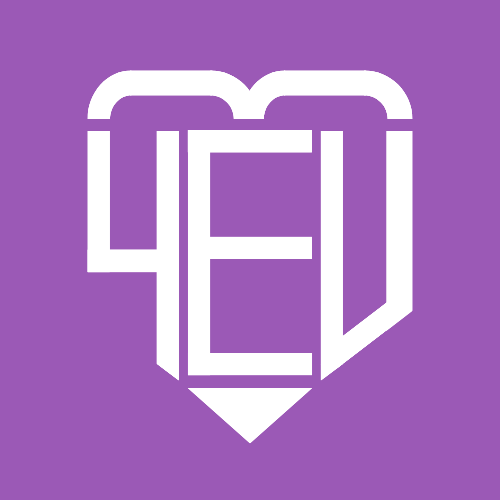

# 4everUS 💜

 <!-- Coloque sua logo nesse caminho -->

---

## 🌟 Sobre o Projeto / About the Project

**PT:**  
4everUS é um site de gerenciamento de relacionamento para casais! Ele acompanha os dias juntos, marca datas importantes e ajuda a planejar presentes e encontros especiais. É um espaço digital para celebrar o amor e o tempo compartilhado.  

**EN:**  
4everUS is a relationship management web app for couples! It tracks the days spent together, highlights important dates, and helps plan gifts and special outings. A digital space to celebrate love and shared moments.  

---

## 🎯 Funcionalidades / Features

- Dashboard do casal / Couple’s dashboard  
- Lista de presentes / Gift ideas list  
- Sugestões de encontros / Date ideas  
- Calendário de datas especiais / Calendar for memorable events  
- Extras futuros: Diário do casal, notificações, animações suaves / Future extras: Couple diary, notifications, smooth animations  

---

## 🛠 Ferramentas / Tools

Aqui vão os ícones (use imagens pequenas ou emojis):  

-  HTML  
-  CSS / Bootstrap  
-  JavaScript  
-  PHP  
-  MySQL  

---

## 🎨 Identidade Visual / Visual Identity

- **Cores principais / Main Colors:** Roxo médio 💜 (#8A2BE2 / #9B59B6), Branco (#FFFFFF)  
- **Modo escuro / Dark Mode:** Roxo médio 💜 e Preto (#1A1A1A)  
- **Tons de apoio / Accent Colors:** Lilás claro (#C39BD3), Roxo profundo (#4B0082), Cinza suave (#F4F4F4)  
- **Tipografia / Typography:**  
  - Títulos: Poppins, Raleway ou Montserrat  
  - Textos: Open Sans, Nunito ou Quicksand  
  - Logo: fonte cursiva leve para destaque de “US” (ex: Great Vibes)  

---

## 📂 Estrutura do Projeto / Project Structure

4everUS/
├── assets/ # Logo, imagens, ícones, fontes
├── css/ # Estilos do site
├── js/ # Scripts front-end
├── php/ # Back-end: login, cadastro, CRUD
├── sql/ # Scripts do banco de dados
├── index.php # Página inicial / login
└── README.md # Este arquivo

---

## ⚡ Como Usar / How to Use

**PT:**  
1. Clone este repositório  
2. Configure seu servidor local (XAMPP ou similar)  
3. Importe `database.sql` no MySQL  
4. Abra `index.php` no navegador  

**EN:**  
1. Clone this repository  
2. Set up your local server (XAMPP or similar)  
3. Import `database.sql` into MySQL  
4. Open `index.php` in your browser  

---

## 📌 Observação / Note

© 2025 André Gritten. Todos os direitos reservados. Este repositório é apenas para visualização. Não copie, modifique ou distribua sem permissão.  
© 2025 André Gritten. All rights reserved. This repository is for viewing purposes only. Do not copy, modify, or redistribute without permission.  

---

💜 Feito com 💻 e criatividade!

